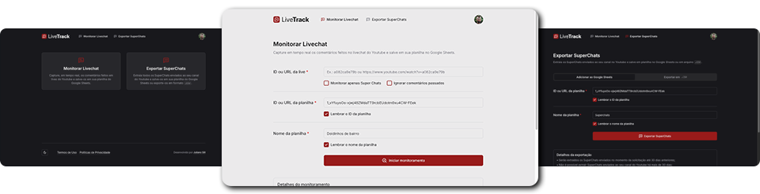

# Livetrack



Aplicação web para capturar em tempo real os comentários das lives e SuperChats enviados ao canal do YouTube do usuário, salvando-os diretamente em uma planilha do Google Sheets ou exportando em formato `.csv`.

🔗 [Acesse a aplicação aqui](https://livetrack.julianosill.com.br)

https://github.com/user-attachments/assets/c1de5f66-2535-4c37-bca2-d5ff1eef28bb

## Tecnologias e ferramentas utilizadas


## Execute o projeto localmente

Para executar este projeto em sua máquina, é necessário possuir o `Node.js` instalado (versão 18 ou superior). Caso não o tenha, instale-o [aqui](https://nodejs.org).

1. Clone este repositório, acesse a pasta do projeto e instale as dependências necessárias.

```bash
git clone https://github.com/julianosill/livetrack.git
cd livetrack
pnpm install
```

2. Crie o arquivo `.env.local` e adicione as variáveis de ambiente necessárias conforme o exemplo abaixo. Ou renomeie o arquivo `.env.sample` e adicione os respectivos valores.

```
GOOGLE_CLIENT_ID=
GOOGLE_CLIENT_SECRET=
GOOGLE_REDIRECT_URI=

JWT_SECRET_KEY=

NEXT_PUBLIC_APP_BASE_URL=
NEXT_PUBLIC_API_BASE_URL=
```

3. Em seguida, execute o comando:

```bach
pnpm dev
```

A aplicação estará disponível no endereço informado em seu terminal, exemplo: [http://localhost:3000](http://localhost:3000).
